## 0. EDA

```r
beers <- read_csv("Beers.csv")
breweries <- read_csv("Breweries.csv")
```

We read in two datasets, one which has data on individual beers and another on the names and locations of breweries. 


```r
beers_unique_val_count <- sapply(beers, function(x) length(unique(x)))
kable(beers_unique_val_count, col.names = c("Unique Count")) %>% kable_styling(full_width = FALSE)
```

<table class="table" style="width: auto !important; margin-left: auto; margin-right: auto;">
 <thead>
  <tr>
   <th style="text-align:left;">   </th>
   <th style="text-align:right;"> Unique Count </th>
  </tr>
 </thead>
<tbody>
  <tr>
   <td style="text-align:left;"> Name </td>
   <td style="text-align:right;"> 2304 </td>
  </tr>
  <tr>
   <td style="text-align:left;"> Beer_ID </td>
   <td style="text-align:right;"> 2410 </td>
  </tr>
  <tr>
   <td style="text-align:left;"> ABV </td>
   <td style="text-align:right;"> 75 </td>
  </tr>
  <tr>
   <td style="text-align:left;"> IBU </td>
   <td style="text-align:right;"> 108 </td>
  </tr>
  <tr>
   <td style="text-align:left;"> Brewery_id </td>
   <td style="text-align:right;"> 558 </td>
  </tr>
  <tr>
   <td style="text-align:left;"> Style </td>
   <td style="text-align:right;"> 100 </td>
  </tr>
  <tr>
   <td style="text-align:left;"> Ounces </td>
   <td style="text-align:right;"> 7 </td>
  </tr>
</tbody>
</table>

```r
brew_unique_val_count <- sapply(breweries, function(x) length(unique(x)))
kable(brew_unique_val_count, col.names = c("Unique Count")) %>% kable_styling(full_width = FALSE)
```

<table class="table" style="width: auto !important; margin-left: auto; margin-right: auto;">
 <thead>
  <tr>
   <th style="text-align:left;">   </th>
   <th style="text-align:right;"> Unique Count </th>
  </tr>
 </thead>
<tbody>
  <tr>
   <td style="text-align:left;"> Brew_ID </td>
   <td style="text-align:right;"> 558 </td>
  </tr>
  <tr>
   <td style="text-align:left;"> Name </td>
   <td style="text-align:right;"> 551 </td>
  </tr>
  <tr>
   <td style="text-align:left;"> City </td>
   <td style="text-align:right;"> 384 </td>
  </tr>
  <tr>
   <td style="text-align:left;"> State </td>
   <td style="text-align:right;"> 51 </td>
  </tr>
</tbody>
</table>
Here we are looking at a count of unique values in each column. We can see there are no duplicate beer or brewery IDs, so each row is related to a specific beer or brewery in their respective datasets. It will be good to look at some of the other variables in a bit. 


```r
beers_missing_count <- sapply(beers, function(x) sum(is.na(x)))
kable(beers_missing_count, col.names = c("Missing Count")) %>% kable_styling(full_width = FALSE)
```

<table class="table" style="width: auto !important; margin-left: auto; margin-right: auto;">
 <thead>
  <tr>
   <th style="text-align:left;">   </th>
   <th style="text-align:right;"> Missing Count </th>
  </tr>
 </thead>
<tbody>
  <tr>
   <td style="text-align:left;"> Name </td>
   <td style="text-align:right;"> 0 </td>
  </tr>
  <tr>
   <td style="text-align:left;"> Beer_ID </td>
   <td style="text-align:right;"> 0 </td>
  </tr>
  <tr>
   <td style="text-align:left;"> ABV </td>
   <td style="text-align:right;"> 62 </td>
  </tr>
  <tr>
   <td style="text-align:left;"> IBU </td>
   <td style="text-align:right;"> 1005 </td>
  </tr>
  <tr>
   <td style="text-align:left;"> Brewery_id </td>
   <td style="text-align:right;"> 0 </td>
  </tr>
  <tr>
   <td style="text-align:left;"> Style </td>
   <td style="text-align:right;"> 5 </td>
  </tr>
  <tr>
   <td style="text-align:left;"> Ounces </td>
   <td style="text-align:right;"> 0 </td>
  </tr>
</tbody>
</table>

```r
brew_missing_count <- sapply(breweries, function(x) sum(is.na(x)))
kable(brew_missing_count, col.names = c("Missing Count")) %>% kable_styling(full_width = FALSE)
```

<table class="table" style="width: auto !important; margin-left: auto; margin-right: auto;">
 <thead>
  <tr>
   <th style="text-align:left;">   </th>
   <th style="text-align:right;"> Missing Count </th>
  </tr>
 </thead>
<tbody>
  <tr>
   <td style="text-align:left;"> Brew_ID </td>
   <td style="text-align:right;"> 0 </td>
  </tr>
  <tr>
   <td style="text-align:left;"> Name </td>
   <td style="text-align:right;"> 0 </td>
  </tr>
  <tr>
   <td style="text-align:left;"> City </td>
   <td style="text-align:right;"> 0 </td>
  </tr>
  <tr>
   <td style="text-align:left;"> State </td>
   <td style="text-align:right;"> 0 </td>
  </tr>
</tbody>
</table>
These tables present a missing count for each variable. The majority of the missing data is in the IBU variable. We will visualize the missing data later on. 

Next we visualize some of the other variables.

```r
ggplot(beers, aes(x = ABV)) + geom_histogram() + labs(title = "Distribution of Alcohol by Volume (ABV)", 
    x = "Alcohol by Volume", y = "Number of Beers") + theme(legend.position = "none", 
    plot.title = element_text(hjust = 0.5), axis.title.y = element_text(angle = 0, 
        vjust = 1))
```

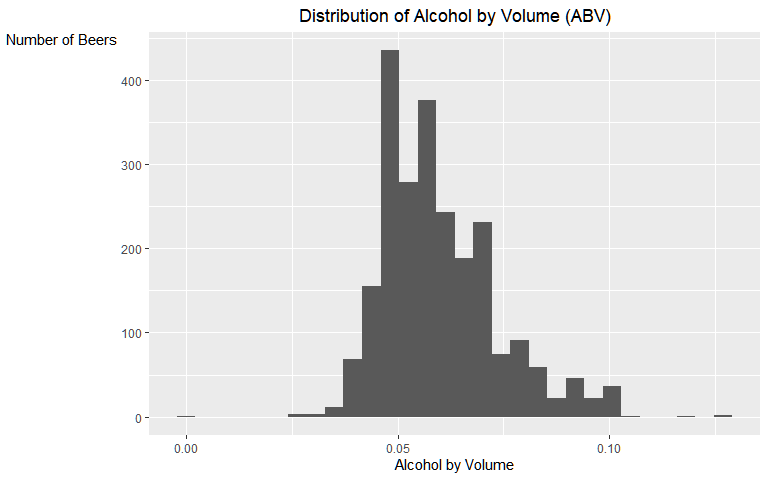<!-- -->

This is the distribution of the Alcohol by Volume variable. It has a small right skew.

```r
ggplot(beers, aes(x = IBU)) + geom_histogram() + labs(title = "Distribution of International Bitterness Unit (IBU)", 
    x = "Bitterness (IBU)", y = "Number of Beers") + theme(legend.position = "none", 
    plot.title = element_text(hjust = 0.5), axis.title.y = element_text(angle = 0, 
        vjust = 1))
```

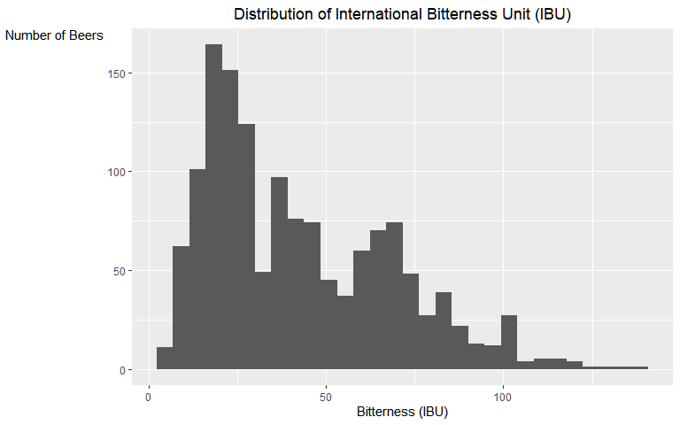<!-- -->

The international bitterness unit has a much more skewed distribution. As a reminder it is also missing a lot of data.

```r
ggplot(beers, aes(as.character(Ounces))) + geom_bar() + labs(title = "Pour Size in Ounces", 
    x = "Size in Ounces (oz)", y = "Number of Beers") + theme(legend.position = "none", 
    plot.title = element_text(hjust = 0.5), axis.title.y = element_text(angle = 0, 
        vjust = 1))
```

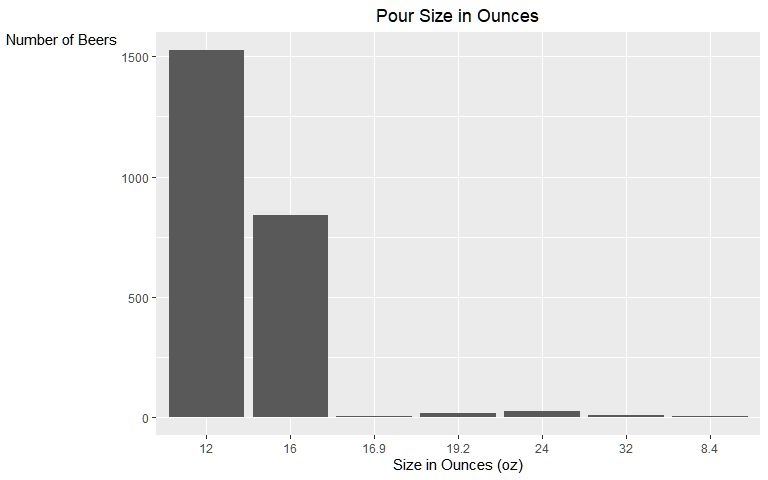<!-- -->
There are 7 different sizes of beers in this data set, however most beers either come in 12oz or 16oz sizes. 


```r
styles <- beers %>% group_by(Style) %>% summarise(count = n()) %>% arrange(-count)
ggplot(head(styles, 10), aes(x = reorder(Style, count), y = count)) + geom_bar(stat = "identity") + 
    coord_flip() + labs(title = "Top 10 Beer Styles", x = "Style", y = "Number of Beers") + 
    theme(legend.position = "none", plot.title = element_text(hjust = 0.5), 
        axis.title.y = element_text(angle = 0, vjust = 1))
```

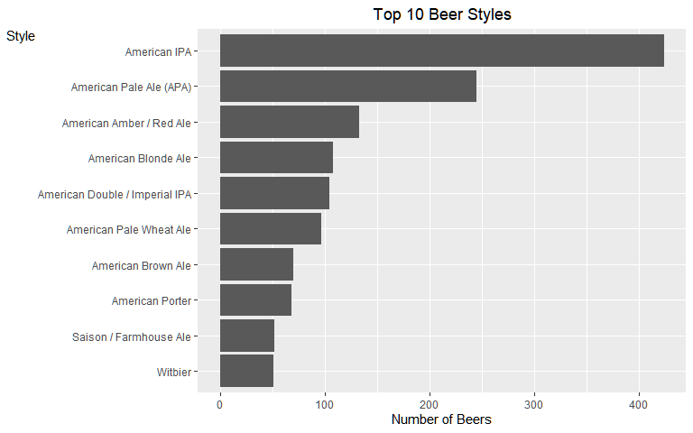<!-- -->

This plot shows the top 10 styles of beer from the dataset. IPA and Pale Ale are the the two strongest by a fair margin.

```r
brewByState <- breweries %>% group_by(State) %>% summarise(count = n()) %>% 
    arrange(-count)
brewByState
```

```
# A tibble: 51 x 2
   State count
   <chr> <int>
 1 CO       47
 2 CA       39
 3 MI       32
 4 OR       29
 5 TX       28
 6 PA       25
 7 MA       23
 8 WA       23
 9 IN       22
10 WI       20
# ... with 41 more rows
```

This is a count of breweries by state. Colorado and California lead with the most breweries


```r
combined <- beers %>% left_join(breweries, by = c(Brewery_id = "Brew_ID")) %>% 
    rename(Beer = "Name.x", Brewery = "Name.y")
byState <- combined %>% select(State, Brewery_id, ABV, IBU) %>% group_by(State) %>% 
    summarise(Brewery_Count = n_distinct(Brewery_id), Median_ABV = median(ABV, 
        na.rm = TRUE), Median_IBU = median(IBU, na.rm = TRUE), Max_ABV = max(ABV, 
        na.rm = TRUE), Max_IBU = max(IBU, na.rm = TRUE))
```
Here we combine the data and create a state level summary to help with further analysis.

## 1. How many breweries are present in each state?

```r
ggplot(head(brewByState, 10), aes(x = reorder(State, count), y = count)) + geom_bar(stat = "identity") + 
    coord_flip() + labs(title = "Top 10 States with the Most Breweries", x = "State", 
    y = "Number of Breweries") + theme(legend.position = "none", plot.title = element_text(hjust = 0.5), 
    axis.title.y = element_text(angle = 0, vjust = 1))
```

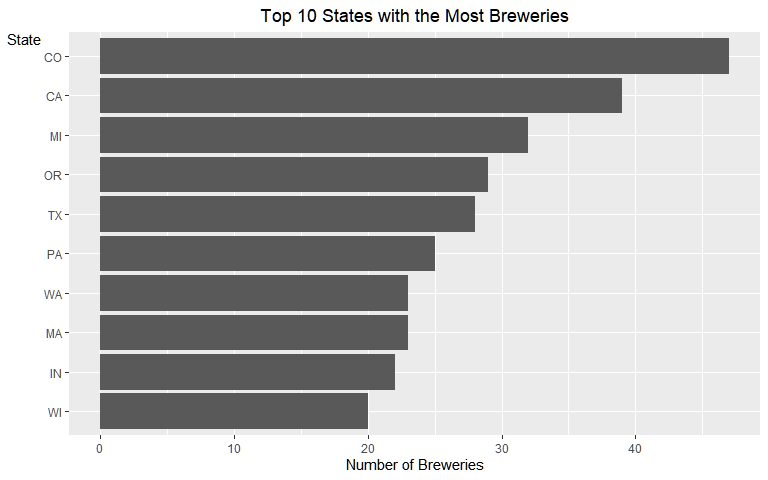<!-- -->

The chart above shows the number of breweries in each state. Colorado, California, Michigan, Oregon, and Texas have the most breweries.


## 2. Merge beer data with the breweries data. Print the first 6 observations and the last six observations to check the merged file.

```r
## We did the merge in the EDA step
head(combined, 6)
```

```
# A tibble: 6 x 10
  Beer   Beer_ID   ABV   IBU Brewery_id Style   Ounces Brewery  City  State
  <chr>    <dbl> <dbl> <dbl>      <dbl> <chr>    <dbl> <chr>    <chr> <chr>
1 Pub B~    1436 0.05     NA        409 Americ~     12 10 Barr~ Bend  OR   
2 Devil~    2265 0.066    NA        178 Americ~     12 18th St~ Gary  IN   
3 Rise ~    2264 0.071    NA        178 Americ~     12 18th St~ Gary  IN   
4 Sinis~    2263 0.09     NA        178 Americ~     12 18th St~ Gary  IN   
5 Sex a~    2262 0.075    NA        178 Americ~     12 18th St~ Gary  IN   
6 Black~    2261 0.077    NA        178 Oatmea~     12 18th St~ Gary  IN   
```

```r
tail(combined, 6)
```

```
# A tibble: 6 x 10
  Beer    Beer_ID   ABV   IBU Brewery_id Style  Ounces Brewery  City  State
  <chr>     <dbl> <dbl> <dbl>      <dbl> <chr>   <dbl> <chr>    <chr> <chr>
1 Rocky ~    1035 0.075    NA        425 Ameri~     12 Wynkoop~ Denv~ CO   
2 Belgor~     928 0.067    45        425 Belgi~     12 Wynkoop~ Denv~ CO   
3 Rail Y~     807 0.052    NA        425 Ameri~     12 Wynkoop~ Denv~ CO   
4 B3K Bl~     620 0.055    NA        425 Schwa~     12 Wynkoop~ Denv~ CO   
5 Silver~     145 0.055    40        425 Ameri~     12 Wynkoop~ Denv~ CO   
6 Rail Y~      84 0.052    NA        425 Ameri~     12 Wynkoop~ Denv~ CO   
```
The exact order depends on the procedure, sometimes it applies a sort which changes the top/bottom rows.

## 3.   Report the number of NA's in each column.

```r
missmap(combined, y.at = c(1), y.labels = c(""))
```

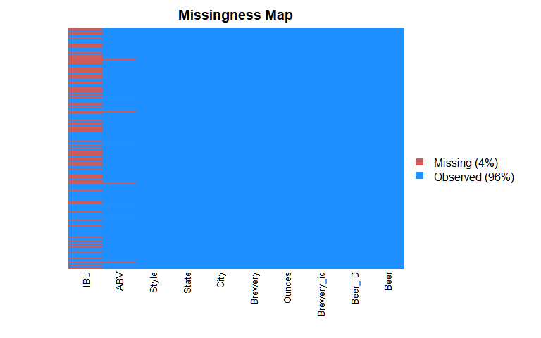<!-- -->

```r
gg_miss_var(combined, show_pct = TRUE) + labs(title = "Percent Missing by Data Field") + 
    theme(legend.position = "none", plot.title = element_text(hjust = 0.5), 
        axis.title.y = element_text(angle = 0, vjust = 1))
```

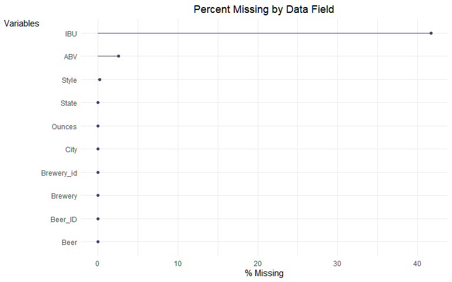<!-- -->

These graphs show information about missing data. The first gives a way to compare across observations and variables where the missing data is. The red lines indicate missing. We can see most of the missing data is in the IBU variable, with a few missing in ABV. The second graph shows the percent of missing data in each column.

## 4.   Compute the median alcohol content and international bitterness unit for each state. Plot a bar chart to compare.

```r
ggplot(byState, aes(x = reorder(State, Median_ABV), y = Median_ABV)) + geom_bar(stat = "identity") + 
    coord_flip() + labs(title = "Median Alchohol by Volume (ABV) by State", 
    x = "State", y = "Median ABV") + theme(legend.position = "none", plot.title = element_text(hjust = 0.5), 
    axis.title.y = element_text(angle = 0, vjust = 1))
```

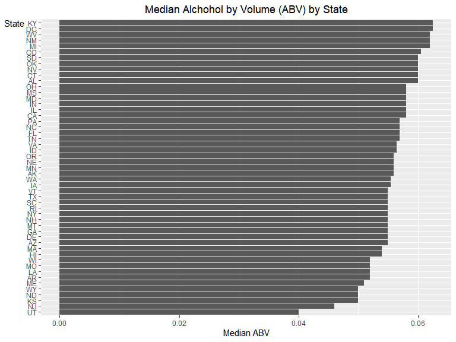<!-- -->

```r
ggplot(byState[byState$State != "SD", ], aes(x = reorder(State, Median_IBU), 
    y = Median_IBU)) + geom_bar(stat = "identity") + coord_flip() + labs(title = "Median Bitterness (IBU) by State", 
    x = "State", y = "Median IBU") + theme(legend.position = "none", plot.title = element_text(hjust = 0.5), 
    axis.title.y = element_text(angle = 0, vjust = 1))
```

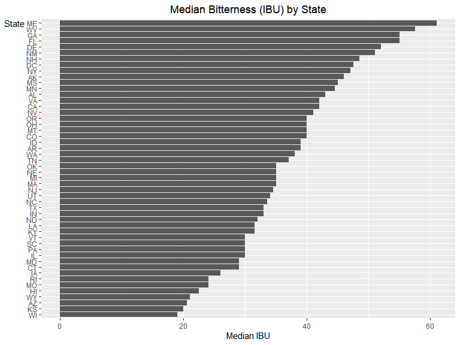<!-- -->

These graphs show the median ABV and IBU by state. Kentucky and DC produce the beers with the highest median alchohol by volume. Maine and West Virginia have the highest median bitterness. South Dakota did not have any bitterness observations.

## 5.   Which state has the maximum alcoholic (ABV) beer? Which state has the most bitter (IBU) beer?

```r
# kable(brew_unique_val_count, col.names = c('Unique Count')) %>%
# kable_styling(full_width = FALSE)
kable(combined[which.max(combined$ABV), ]) %>% kable_styling(full_width = FALSE)
```

<table class="table" style="width: auto !important; margin-left: auto; margin-right: auto;">
 <thead>
  <tr>
   <th style="text-align:left;"> Beer </th>
   <th style="text-align:right;"> Beer_ID </th>
   <th style="text-align:right;"> ABV </th>
   <th style="text-align:right;"> IBU </th>
   <th style="text-align:right;"> Brewery_id </th>
   <th style="text-align:left;"> Style </th>
   <th style="text-align:right;"> Ounces </th>
   <th style="text-align:left;"> Brewery </th>
   <th style="text-align:left;"> City </th>
   <th style="text-align:left;"> State </th>
  </tr>
 </thead>
<tbody>
  <tr>
   <td style="text-align:left;"> Lee Hill Series Vol. 5 - Belgian Style Quadrupel Ale </td>
   <td style="text-align:right;"> 2565 </td>
   <td style="text-align:right;"> 0.128 </td>
   <td style="text-align:right;"> NA </td>
   <td style="text-align:right;"> 52 </td>
   <td style="text-align:left;"> Quadrupel (Quad) </td>
   <td style="text-align:right;"> 19.2 </td>
   <td style="text-align:left;"> Upslope Brewing Company </td>
   <td style="text-align:left;"> Boulder </td>
   <td style="text-align:left;"> CO </td>
  </tr>
</tbody>
</table>

```r
kable(combined[which.max(combined$IBU), ]) %>% kable_styling(full_width = FALSE)
```

<table class="table" style="width: auto !important; margin-left: auto; margin-right: auto;">
 <thead>
  <tr>
   <th style="text-align:left;"> Beer </th>
   <th style="text-align:right;"> Beer_ID </th>
   <th style="text-align:right;"> ABV </th>
   <th style="text-align:right;"> IBU </th>
   <th style="text-align:right;"> Brewery_id </th>
   <th style="text-align:left;"> Style </th>
   <th style="text-align:right;"> Ounces </th>
   <th style="text-align:left;"> Brewery </th>
   <th style="text-align:left;"> City </th>
   <th style="text-align:left;"> State </th>
  </tr>
 </thead>
<tbody>
  <tr>
   <td style="text-align:left;"> Bitter Bitch Imperial IPA </td>
   <td style="text-align:right;"> 980 </td>
   <td style="text-align:right;"> 0.082 </td>
   <td style="text-align:right;"> 138 </td>
   <td style="text-align:right;"> 375 </td>
   <td style="text-align:left;"> American Double / Imperial IPA </td>
   <td style="text-align:right;"> 12 </td>
   <td style="text-align:left;"> Astoria Brewing Company </td>
   <td style="text-align:left;"> Astoria </td>
   <td style="text-align:left;"> OR </td>
  </tr>
</tbody>
</table>

Colorado produces the beer "Lee Hill Series Vol. 5"  with the highest alcohol content in our dataset at 12.8%. Oregon produces the beer "Bitter Bitch" which is the most bitter beer in our data set with an IBU of 138.

## 6.   Summary statistics for the ABV variable. 

```r
kable(as.array(summary(combined$ABV)), digits = 3, col.names = c("Stat", "Value")) %>% 
    kable_styling(full_width = FALSE)
```

<table class="table" style="width: auto !important; margin-left: auto; margin-right: auto;">
 <thead>
  <tr>
   <th style="text-align:left;"> Stat </th>
   <th style="text-align:right;"> Value </th>
  </tr>
 </thead>
<tbody>
  <tr>
   <td style="text-align:left;"> Min. </td>
   <td style="text-align:right;"> 0.001 </td>
  </tr>
  <tr>
   <td style="text-align:left;"> 1st Qu. </td>
   <td style="text-align:right;"> 0.050 </td>
  </tr>
  <tr>
   <td style="text-align:left;"> Median </td>
   <td style="text-align:right;"> 0.056 </td>
  </tr>
  <tr>
   <td style="text-align:left;"> Mean </td>
   <td style="text-align:right;"> 0.060 </td>
  </tr>
  <tr>
   <td style="text-align:left;"> 3rd Qu. </td>
   <td style="text-align:right;"> 0.067 </td>
  </tr>
  <tr>
   <td style="text-align:left;"> Max. </td>
   <td style="text-align:right;"> 0.128 </td>
  </tr>
  <tr>
   <td style="text-align:left;"> NA's </td>
   <td style="text-align:right;"> 62.000 </td>
  </tr>
</tbody>
</table>

```r
ggplot(combined[!is.na(combined$ABV), ], aes(x = "", y = ABV)) + geom_boxplot(alpha = 0.4) + 
    stat_summary(fun.y = mean, geom = "point", shape = 20, size = 10, color = "red", 
        fill = "red") + labs(x = "", y = "Alcohol by Volume") + theme(legend.position = "none", 
    axis.title.y = element_text(angle = 0, vjust = 1))
```

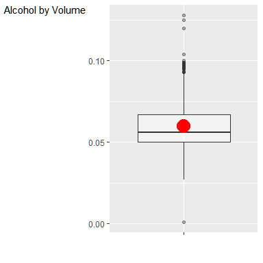<!-- -->

At least 75% of beers have a ABV of less than 6.7%

## 7.   Is there an apparent relationship between the bitterness of the beer and its alcoholic content? Draw a scatter plot.

```r
ggplot(combined, aes(x = IBU, y = ABV)) + geom_point() + geom_smooth(method = lm, 
    se = FALSE) + labs(title = "Relationship between Alcohol Content and Bitterness", 
    x = "Bitterness", y = "Alcohol by Volume") + theme(legend.position = "none", 
    plot.title = element_text(hjust = 0.5), axis.title.y = element_text(angle = 0, 
        vjust = 1))
```

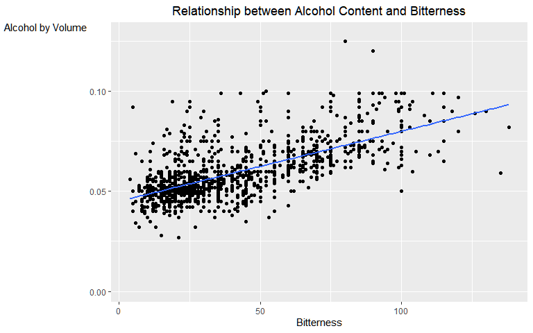<!-- -->

There is a positive relationship between Alcohol Content and Bitterness.

## 8. MAPS!


```r
## Code derived from tutorial found at https://socviz.co/maps.html
us_states <- map_data("state")
us_states[us_states$region == "district of columbia", "abb"] <- "DC"
us_states$abb <- state.abb[match(us_states$region, tolower(state.name))]
map_withBrew <- us_states %>% left_join(brewByState, by = c(abb = "State")) %>% 
    rename(BreweryCount = "count")
start_map <- ggplot(data = map_withBrew, mapping = aes(x = long, y = lat, group = group, 
    fill = BreweryCount))
map_2 <- start_map + geom_polygon(color = "gray90", size = 0.1) + coord_map(projection = "albers", 
    lat0 = 39, lat1 = 45)

map_2 + labs(title = "Brewery Count by State") + theme_map() + labs(fill = "Brewery Count") + 
    theme(plot.title = element_text(hjust = 0.5))
```

<!-- -->
